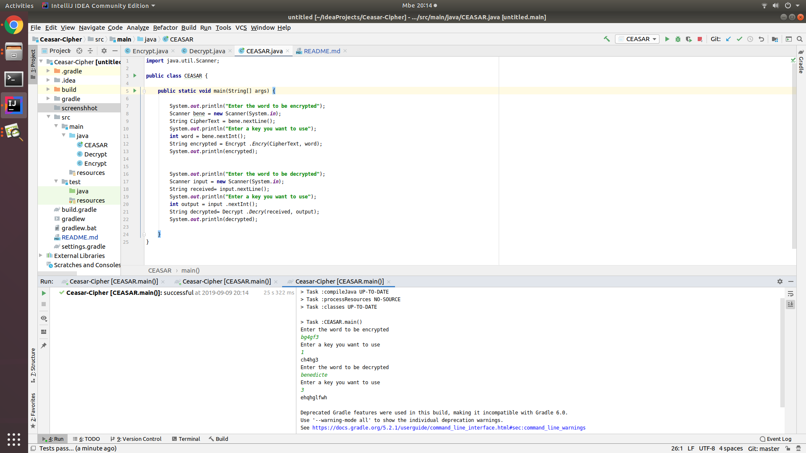

# Ceasar--Cipher
By Manishimwe BENEDICTE

 ## Description
 * This project was generated with IntellJ IDEA version
 * This project is for building the cease cipher algarithm where it is possible to encrypt the word or decrypt it.

### User requirements
* OS: ubuntu or MAC.
 
* internet connexion.

* IntellJ IDEA installed
* Clone the project; git clone https://github.com/mybene/Ceasar--Cipher.git.

### BDD
* enter any messange/word as input
* enter any number as key
* choose between encrypt and decrypt
* The output will the encrypted or decrypted word according your choice.

### Technologies used.
* Java

###  Screenshoot

### License
Copyright(c)2019,Moringa school

